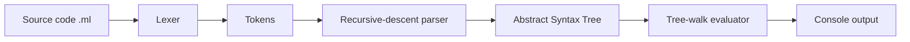
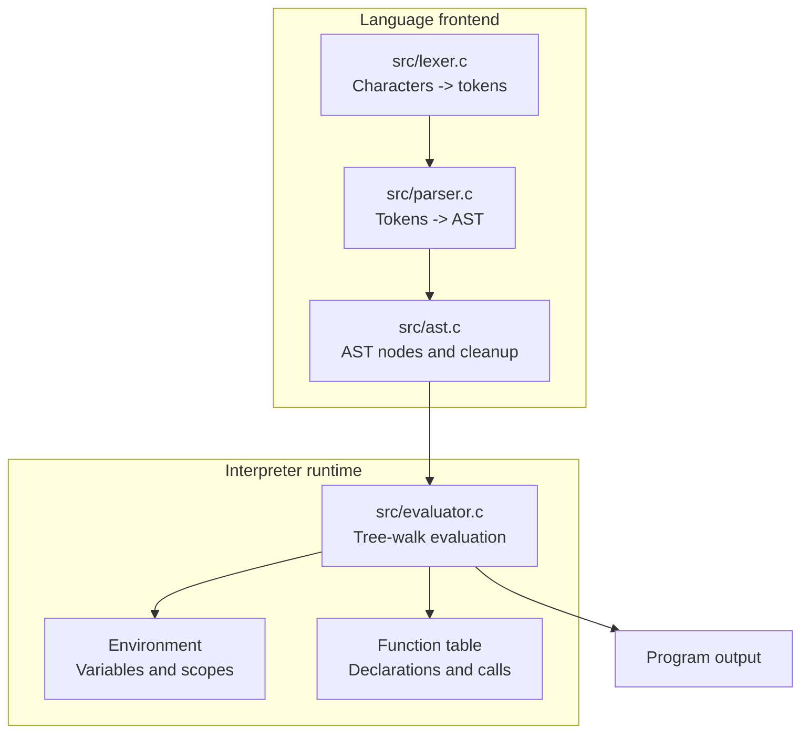

# MiniLang

> A small interpreted programming language built from scratch in C99.


MiniLang is an educational compiler-style project that demonstrates how source code becomes executable behavior through a lexer, recursive-descent parser, AST, and tree-walk evaluator.

> MiniLang evaluates an AST directly. It does not generate native machine code or assembly.

## Processing Pipeline



## Features

| Category | Supported features |
| --- | --- |
| Values | Integer and numeric literals |
| Expressions | `+`, `-`, `*`, `/`, parentheses, operator precedence |
| Variables | `let` declarations and reassignment |
| Comparisons | `>`, `<`, `>=`, `<=`, `==`, `!=` |
| Control flow | `if`, `else`, `while` |
| Functions | Parameters, calls, and `return` |
| Output | `print()` |
| Comments | Single-line comments using `//` |
| Errors | Syntax errors, runtime errors, division by zero, undefined variables/functions |

## Architecture



### Main Stages

1. **Lexer:** Converts source characters into tokens and skips whitespace/comments.
2. **Parser:** Uses recursive descent to validate syntax and enforce expression precedence.
3. **AST:** Stores the structure of expressions, statements, functions, and control flow.
4. **Evaluator:** Walks the AST, manages environments, and produces output.

## MiniLang Syntax

### Arithmetic and Variables

```text
let total = 10 + 20 * 2;
print(total);
```

Output:

```text
50
```

### Conditions and Loops

```text
let i = 1;

while (i <= 3) {
    if (i == 2) {
        print(20);
    } else {
        print(i);
    }
    i = i + 1;
}
```

### Functions

```text
function add(a, b) {
    return a + b;
}

print(add(10, 20));
```

Output:

```text
30
```

### Comments

```text
// Single-line comment
print(5 * 2);
```

## Project Structure

```text
MiniLang/
|-- src/
|   |-- main.c          CLI and pipeline setup
|   |-- lexer.c/.h      Lexical analysis
|   |-- parser.c/.h     Recursive-descent parser
|   |-- ast.c/.h        AST construction and cleanup
|   `-- evaluator.c/.h  Tree-walk evaluator and runtime
|-- examples/           Example MiniLang programs
|-- demo.ml             Demonstration program
|-- Makefile            GCC build configuration
`-- README.md           Project documentation
```

## Build and Run

### Requirements

- GCC
- GNU Make (optional)

### Build

```bash
make
```

Or compile directly:

```bash
gcc src/main.c src/lexer.c src/parser.c src/ast.c src/evaluator.c -o minilang -Wall -Wextra -std=c99 -O2
```

### Run

Windows PowerShell:

```powershell
.\minilang.exe examples\hello.ml
```

Linux/macOS:

```bash
./minilang examples/hello.ml
```

## Inspection Options

Use these options to observe intermediate stages:

| Command | Result |
| --- | --- |
| `minilang file.ml --tokens` | Displays lexer tokens |
| `minilang file.ml --dump-ast` | Displays the full AST |
| `minilang file.ml --compact-ast` | Displays a compact AST |
| `minilang --help` | Displays command help |

Example:

```powershell
.\minilang.exe examples\hello.ml --dump-ast
```

## Examples

- `hello.ml` - basic arithmetic and output
- `02_precedence.ml` - precedence and parentheses
- `03_variables.ml` - declarations and assignment
- `04_condition.ml` - conditions and comparisons
- `05_loop.ml` - loops
- `06_functions.ml` - functions and return values
- `07_fibonacci.ml` - recursion and control flow
- `08_error_handling.ml` - diagnostic examples


## Limitations

MiniLang is intentionally small and educational. It does not include native code generation, a large standard library, static type checking, or compiler optimization passes.
